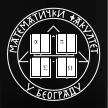

# Razvoj softvera - Matematički fakultet

## Nastavno osoblje
- Predavanja
    - [Saša Malkov](http://poincare.matf.bg.ac.rs/~smalkov/)
- Vežbe
    - [Nemanja Mićović](http://poincare.matf.bg.ac.rs/~nemanja_micovic)
    - [Nikola Ajzenhamer](https://matf.nikolaajzenhamer.rs/)

## Plan vežbi po temama

1. [C++] Uvod. Strukture podataka u standardnoj biblioteci.
1. [C++] Upravljanje dinamičkim resursima. Pametni pokazivači. RAII idiom.
1. [C++] Objektno-orijentisano programiranje. UML dijagrami klasa.
1. [Qt5] Kreiranje grafičkih korisničkih interfejsa. _Radni okvir grafičke scene._
1. [C++] Parametarski polimorfizam.
1. [C++] Odabrani algoritmi iz STL. Elementi funkcionalne paradigme.
1. [Catch2] Testiranje softvera. Razvoj vođen testovima.
1. [Qt5] Programiranje višenitnih aplikacija. Osnove sinhronizacije niti.
1. [C++,CMake] _Izgradnja C++ biblioteka i povezivanje funkcija. Sistemi za izgradnju koda._
1. [Qt5] Serijalizacija i deserijalizacija podataka.
1. [Qt5] _Arhitektura softvera. Model-pogled arhitektura._

Teme koje se ne proveravaju na praktičnim proverama znanja su prikazane _iskošenim_ slovima.

## Bodovanje

**Informacije navedene ispod o polaganju kursa su podložne promenama, u zavisnosti od okolnosti.**

- Predispitne obaveze
    - Timski projekat
        - 30 poena
- Završni ispit
    - Praktično-teorijski deo
        - 50 poena
        - Pragovi za izlazak na usmeni deo
            - 50% na zadacima
            - 50% od ukupnog broja poena
            - Odnos zadataka i teorijskih pitanja je 6:5
    - Usmeni deo
        - 20 poena

## Projekti

Detaljne informacije možete pronaći u [ovom dokumentu](https://docs.google.com/document/d/1q13w99Jr4e6dK2eSsOLzcTrerUJixsjwG_WRRmvg-MA/edit?usp=sharing).

## Očekivanja od studenata

- Samostalno istraživanje i redovno učenje
    - Preporučeni delovi iz literature i članci
    - Domaći zadaci
- Aktivno istraživanje rešenja problema tokom rada na projektu
    - Dokumentacija
    - StackOverflow i sl.
- Redovno praćenje obaveštenja
    - Sajtovi profesora i asistenata
- Ankete za prijavljivanje povodom izlaska na kolokvijum ili ispit
    - Student se prijavljuje na anketu **samo ako sa velikom verovatnoćom** izlazi na proveru znanja
    - U slučaju da se student prijavi na anketu, a u međuvremenu ipak odustane, OBAVEZNO je javiti se asistentu putem mejla
    - Ovime nam drastično olakšavate organizaciju ispita
